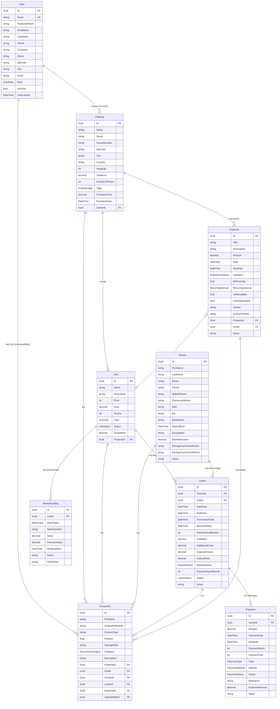

# 🗃️ Datenmodell

> **Letzte Aktualisierung:** 2026-02-07  
> **Hinweis:** Bei Änderungen an Entities, Enums oder Beziehungen dieses Dokument aktualisieren.

## ER-Diagramm

## BaseEntity (Basisklasse)

Alle Entities erben von `BaseEntity`:

| Feld        | Typ         | Beschreibung                     |
| ----------- | ----------- | -------------------------------- |
| `Id`        | `Guid`      | Primärschlüssel (auto-generiert) |
| `CreatedAt` | `DateTime`  | Erstellungszeitpunkt (UTC)       |
| `UpdatedAt` | `DateTime?` | Letzte Änderung (UTC)            |
| `IsDeleted` | `bool`      | Soft-Delete Flag                 |

## Enums

### UserRole

| Wert        | Beschreibung                        |
| ----------- | ----------------------------------- |
| `Admin`     | Administrator mit vollem Zugriff    |
| `Vermieter` | Standard-Benutzerrolle (Eigentümer) |
| `Readonly`  | Nur lesender Zugriff                |

### PropertyType

| Wert               | Beschreibung                       |
| ------------------ | ---------------------------------- |
| `Einfamilienhaus`  | Einzelnes Wohngebäude              |
| `Mehrfamilienhaus` | Gebäude mit mehreren Wohneinheiten |
| `Gewerbeimmobilie` | Gewerblich genutzt                 |
| `MischGewerbeWohn` | Gemischt Gewerbe und Wohnen        |
| `Garage`           | Garage / Stellplätze               |
| `Grundstueck`      | Unbebautes Grundstück              |

### UnitType

| Wert         | Beschreibung  |
| ------------ | ------------- |
| `Wohnung`    | Wohneinheit   |
| `Gewerbe`    | Gewerbefläche |
| `Garage`     | Garage        |
| `Stellplatz` | Parkplatz     |
| `Keller`     | Kellerraum    |
| `Sonstige`   | Andere        |

### UnitStatus

| Wert            | Beschreibung                   |
| --------------- | ------------------------------ |
| `Vermietet`     | Einheit ist vermietet          |
| `Leer`          | Einheit steht leer (Leerstand) |
| `InRenovierung` | Wird gerade renoviert          |
| `Eigennutzung`  | Vom Eigentümer selbst genutzt  |

### LeaseStatus

| Wert         | Beschreibung             |
| ------------ | ------------------------ |
| `Aktiv`      | Laufender Mietvertrag    |
| `Gekuendigt` | Vertrag wurde gekündigt  |
| `Beendet`    | Vertrag ist beendet      |
| `Entwurf`    | Vertrag noch nicht aktiv |

### DepositStatus

| Wert             | Beschreibung                |
| ---------------- | --------------------------- |
| `Ausstehend`     | Kaution noch nicht gezahlt  |
| `Teilweise`      | Teilweise gezahlt           |
| `Vollstaendig`   | Vollständig gezahlt         |
| `Zurueckgezahlt` | Kaution wurde zurückgezahlt |

### PaymentType

| Wert           | Beschreibung                             |
| -------------- | ---------------------------------------- |
| `Miete`        | Monatliche Mietzahlung                   |
| `Kaution`      | Kautionszahlung                          |
| `Nachzahlung`  | Nachzahlung (z.B. Nebenkostenabrechnung) |
| `Rueckzahlung` | Rückzahlung an Mieter                    |
| `Sonstige`     | Sonstige Zahlung                         |

### PaymentMethod

| Wert           | Beschreibung       |
| -------------- | ------------------ |
| `Ueberweisung` | Banküberweisung    |
| `Lastschrift`  | SEPA-Lastschrift   |
| `Bar`          | Barzahlung         |
| `PayPal`       | PayPal             |
| `Sonstige`     | Andere Zahlungsart |

### PaymentStatus

| Wert           | Beschreibung                   |
| -------------- | ------------------------------ |
| `Eingegangen`  | Zahlung ist eingegangen        |
| `Ausstehend`   | Zahlung steht noch aus         |
| `Ueberfaellig` | Fälligkeitsdatum überschritten |
| `Teilzahlung`  | Nur teilweise gezahlt          |
| `Storniert`    | Zahlung wurde storniert        |

### ExpenseCategory

| Wert               | Beschreibung            | Umlagefähig? |
| ------------------ | ----------------------- | ------------ |
| `Reparatur`        | Reparaturkosten         | ggf.         |
| `Wartung`          | Wartungsarbeiten        | ggf.         |
| `Versicherung`     | Gebäudeversicherung     | ✅           |
| `Grundsteuer`      | Grundsteuer             | ✅           |
| `Hausverwaltung`   | Hausverwaltungskosten   | ✅           |
| `Wasser`           | Wasserversorgung        | ✅           |
| `Heizung`          | Heizkosten              | ✅           |
| `Strom`            | Allgemeinstrom          | ✅           |
| `Muellabfuhr`      | Müllentsorgung          | ✅           |
| `Schornsteinfeger` | Schornsteinfegerkosten  | ✅           |
| `Gartenpflege`     | Gartenpflege            | ✅           |
| `Reinigung`        | Treppenhausreinigung    | ✅           |
| `Aufzug`           | Aufzugswartung          | ✅           |
| `Bankgebuehren`    | Kontoführung            | ❌           |
| `Zinsen`           | Darlehenszinsen         | ❌           |
| `Abschreibung`     | AfA                     | ❌           |
| `Renovierung`      | Größere Renovierung     | ❌           |
| `Modernisierung`   | Modernisierungsmaßnahme | ❌           |
| `Rechtskosten`     | Anwalts-/Gerichtskosten | ❌           |
| `Sonstige`         | Sonstiges               | ggf.         |

### RecurringInterval

| Wert            | Beschreibung    |
| --------------- | --------------- |
| `Monatlich`     | Jeden Monat     |
| `Quartalsweise` | Alle 3 Monate   |
| `Halbjaehrlich` | Alle 6 Monate   |
| `Jaehrlich`     | Einmal pro Jahr |

### MeterType

| Wert         | Beschreibung                         |
| ------------ | ------------------------------------ |
| `Wasser`     | Kaltwasserzähler                     |
| `WarmWasser` | Warmwasserzähler                     |
| `Gas`        | Gaszähler                            |
| `Strom`      | Stromzähler                          |
| `Heizung`    | Heizungszähler / Heizkostenverteiler |
| `Sonstige`   | Anderer Zählertyp                    |

### DocumentCategory

| Wert                    | Beschreibung                    |
| ----------------------- | ------------------------------- |
| `Mietvertrag`           | Mietvertragsdokument            |
| `Uebergabeprotokoll`    | Wohnungsübergabe-Protokoll      |
| `Nebenkostenabrechnung` | Jährliche Nebenkostenabrechnung |
| `Rechnung`              | Rechnung / Beleg                |
| `Versicherungspolice`   | Versicherungsdokument           |
| `Grundbuchauszug`       | Grundbuchauszug                 |
| `Energieausweis`        | Energieausweis                  |
| `Korrespondenz`         | Schriftverkehr                  |
| `Foto`                  | Foto / Bild                     |
| `Sonstige`              | Sonstiges Dokument              |

## Business Rules

1. **Property → Units:** Eine Immobilie kann beliebig viele Einheiten haben
2. **Lease verbindet Tenant + Unit:** Ein Mietvertrag verbindet genau einen Mieter mit genau einer Einheit
3. **Aktiver Mietvertrag:** `Status == Aktiv && StartDate <= Jetzt && (EndDate == null || EndDate > Jetzt)`
4. **Unit-Status-Automatik:** Beim Erstellen eines Lease wird die Unit auf `Vermietet` gesetzt, beim Beenden auf `Leer`
5. **Soft Delete:** Entities werden nie physisch gelöscht, nur `IsDeleted = true`
6. **Zählerstand-Verbrauch:** Bei neuer Ablesung wird automatisch der vorherige Wert gespeichert → `Consumption = Value - PreviousValue`
7. **Warmmiete:** `TotalRent = ColdRent + AdditionalCosts` (berechnet, nicht gespeichert)
8. **Kaution:** `DepositFullyPaid = DepositPaid >= DepositAmount` (berechnet)
9. **Document-Zuordnung:** Ein Dokument kann flexibel zu Property, Unit, Tenant, Lease oder Expense gehören
10. **Multi-Tenancy:** Jede Property gehört einem User (OwnerId) – Eigentümer sehen nur ihre eigenen Daten
